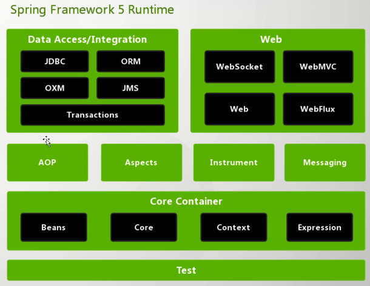
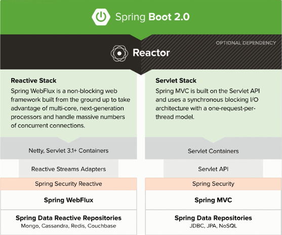
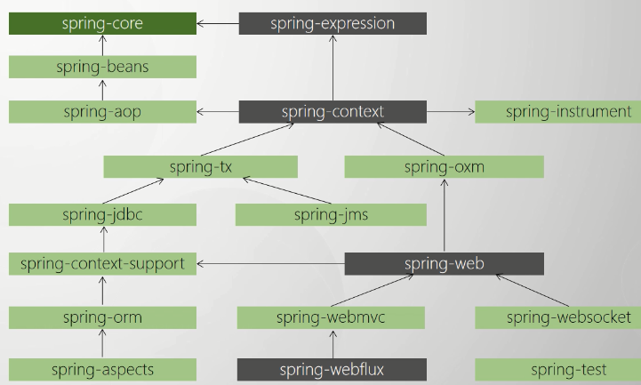

## Spring

#### Spring的一切都是为了简化开发

现在的Spring已成为大部分企业的Java开发标准，根源在于使用Spring来开发项目是很方便，特别在SpinrgBoot和SpringCloud问世后，几乎无配置的开发让我们告别了Spring3.X之前xml繁多的噩梦。

Spring中BOP，即一切都以面向Bean编程来源于Java本身中Bean。

JavaBean是AppletBean演变而来，当时这些对象可以进行一些动态的展示，但是随着Java被越来越多的使用，Applet显然已经不能支持，所以我们有了JSP这样更好支持动态网页的技术。而随之而来的就是EJB，也就是EnterpriceJavaBean，支持企业级开发的JavaBean，而现在已经成为大家熟悉的POJO对象，PlainOrdinaryJavaObject，简单的JavaBean，现在的bean可以是VO，也可以是PO，用于前后端的数据交互，或者业务内容数据的载体等，只要你new出来的对象，就可以是POJO。

而Spring，则是沿用了Java中的Bean的概念，只不过Java一开始的口号是OOP，面向对象编程，Spring则是BOP，面向Bean编程，其实都是一个意思。

#### Spring简化开发的四个基本策略

* 基于POJO的轻量级和最小侵入性编程
  * 在Java中，我们有时候要实现一些功能，是需要实现一些特定的接口的，例如要实现线程的功能，需要继承Thread，或者实现Runnable；要实现定时器，需要继承Timer；需要实现JDK动态代理，需要实现InvcationHandler接口等，这些你可以理解成这是Java中的**规则**，你需要符合规则，才能实现功能，而这对相应实现了功能的类来说，就变成比较**重量级**了，并且由于你要实现功能，你是需要增加代码到这个类里的，只要有新功能，你就是要增加代码的，这样的侵入性就很高。
  * 但是Java中，当你想要实现某个功能的时候，例如想要用事务接管你关于数据库的方法，老的xml配置需要将目标所在包名下的类中方法都囊括进事务中，你的方法只需要关注你的业务，关于打开数据库，关闭连接，事务的开启和关闭你都不再需要关心，侵入性大大降低，而且由于大部分繁琐的功能Spring通过代理将你的POJO增强了，所以在代码里你的类，将会变得很**专一**且**轻量**。
* 通过依赖注入和面向接口松耦合
  * 有了依赖注入，Spring会帮我们从IoC容器中已初始化好的对象，设置到目标对象中，省去了我们new出了对象，还需要通过构造方法或者set与get方法来进行赋值的繁琐操作。
  * 我们都知道Spring中被注入的对象都是接口，这是规范，具体实现由Spring自己通过实现了该接口的实现类进行注入，高一层次的抽象可以进行解耦。
* 基于切面和惯性进行声明式编程
  * Spring中的切面编程，是Spring的伟大发明，众多优秀的特性也是基于切面思想才能得以体现。Spring将常用的操作，例如事务的开启关闭，又或者我们可以实现自己的日志，性能的记录等，将某一个操作封装成切面，在某一个我们的操作前(Before)，操作后(After)进行不同的切面操作，来达到强大的增强效果。
  * 声明式代表，是自定义的，你让Spring怎么做的，他就会按照你的要求怎么做。是显示的。
  * 惯性，符合开发人员的习惯，例如命名规则等。
* 通过切面和模版减少样板的代码
  * Spring中也有很多内置的切面实现，包括JdbcTemplate、又或者模版的解析，Session的管理，事务的托管等。
  * 由于Spring中很多内置的切面实现，无须开发者自己实现。

#### Spring中的编程思想

| Spriing思想 | 应用场景(特定)                                               | 总结             |
| ----------- | ------------------------------------------------------------ | ---------------- |
| OOP         | Objecct Oriented Programming (面向对象编程)用java Object 来描述生活中的一切事物 | 封装、继承、多态 |
| BOP         | Bean Oriented Programming (面向Bean编程) 面向Bean(普通的Java类)设计程序 | 一切以Bean为主   |
| AOP         | Aspect Oriented Programming(面向切面编程，)抽离出多个逻辑中相同的部分，将他们从原逻辑中封装抽离出来，只保留最纯粹的业务逻辑，而在运行的时将他们合并起来，组成和原来一样的效果。面向切面规则编程。 | 解耦，单一职责。 |
| IOC         | Inversion of Control (控制反转）由原来由开发者来管理对象的生命周期，交付由Spring容器来接管，控制权进行反转。 | 转交控制权       |
| DI/DL       | Dependency Injection（依赖注入）或者 Dependency Lookup （依赖查找），所谓的依赖，也就是对象和对象之前的关系，再直白点就是成员变量的初始化由Spring来完成，且Spring将会保存这些对象的关系。赋值的方法有构造方法，set方法，和直接复制。 | 成员的初始化     |

#### Spring5模块结构图

#### Spring5到SpringBoot

Spring5作为SpringBoot2.0的底层支持，他也在背地里做了很多自己的工作，一个比较明显的就是**去Servlet化**即不再依靠Servlet容器来实现Web的功能，而是自己开发一套自己的标准，所以SpringBoot有了自己的独特的Web风格，也就是Reactive，Spring作为一个生态，在完善自己的Web方面的市场占有，取而代之的就是使用Netty做技术支撑。

#### Spring 系统架构之核心模版

| 模块名称               | 主要功能                                 |
| ---------------------- | ---------------------------------------- |
| spring-core            | 依赖注入IOC与DI的最基本实现              |
| spring-beans           | Bean工厂与Bean的装配                     |
| spring-context         | 定义基础的Spring的Context上下文即IOC容器 |
| spring-context-support | 对SprngIOC容器的扩展支持，以及IOC子容器  |
| spring-context-indexer | Spring的类管理组件和Classpath扫描        |
| spring-expression      | Spring表达式语言                         |

#### Spring系统架构之切面编程模块

| 模块名称          | 主要功能                                         |
| ----------------- | ------------------------------------------------ |
| spring-aop        | 面向切面编程的应用模块，整合Asm，CGLib、JDKProxy |
| spring-aspects    | 集成AspectJ，AOP应用框架                         |
| spring-instrument | 动态Class Loading 模块                           |

#### Spring之数据访问与集成模块

| 模块名称    | 主要功能                                                     |
| ----------- | ------------------------------------------------------------ |
| spring-jdbc | Spring 提供的JDBC抽象框架的主要实现模块，用于简化Spring JDBC操作 |
| spring-tx   | Spring JDBC事务控制实现模块                                  |
| spring-orm  | 主要集成Hibernate，Java Persistence API （JPA）和Java Data Object (JDO) |
| spring-oxm  | 将Java对象映射成XML数据，或者将XML数据映射成Java对象         |
| spring-jms  | Java Messaging Service 能够发送和接受消息                    |

#### Spring 之 Web模块

| 模块名称         | 主要功能                                                     |
| ---------------- | ------------------------------------------------------------ |
| spring-web       | 提供了最基础的Web支持，主要建立于核心容器之上，通过Servlet或者Listeners来初始化IOC容器 |
| spring-webmvc    | 实现了Spring MVC （model-view-Controller）的Web应用          |
| spring-websocket | 主要是与Web前端的全双工通信协议(需要基于servlet3.0)          |
| spring-webflux   | 一个新的非阻塞函数式Reactive Web框架，可以用来建立异步的非阻塞，事件驱动的服务。 |

#### Spring之通信报文模块

| 模块名称         | 主要功能                                                     |
| ---------------- | ------------------------------------------------------------ |
| spring-messaging | 从Spring4开始新加入的一个模块，主要职责是为Spring框架继承一些基础的报文传送应用。 |

#### Spring之集成测试模块

| 模块名称    | 主要功能             |
| ----------- | -------------------- |
| spring-test | 主要为测试提供支持的 |

#### Spring之集成兼容模块

| 模块名称             | 主要功能                                               |
| -------------------- | ------------------------------------------------------ |
| spring-framework-bom | Bill of Materials.解决Spring的不同模块依赖版本不同问题 |

#### Spring 各个模块之间的依赖关系

spring-core是所有的基础，灰色的表示扩展类的。

#### Spring的命名规范

> 常见的软件版本命名规范

| 软件         | 升级过程                               | 说明                                                  |
| ------------ | -------------------------------------- | ----------------------------------------------------- |
| Linux Kernel | 0.0.1、1.0.0、2.6.32                   | 若用X.Y.Z表示，则偶数Y表示稳定版本，奇数Y代表开发版本 |
| Windows      | Window 98、Window 2000、Window  XP ... | 其实没什么规律，想怎么来怎么来                        |
| SSH Client   | 0.98                                   |                                                       |
| OpenStack    | 2014.1.3、2015.1.1.dev8                |                                                       |

> 语义化版本命名通用规则

| 序号 | 格式要求 | 说明                                                         |
| ---- | -------- | ------------------------------------------------------------ |
| X    | 非负整数 | 表示主版本号(Major)，当API的兼容性变化时，X需递增。例如参数修改了，返回值修改之类影响api使用的修改。 |
| Y    | 非负整数 | 表示次版本号(Minor)，当增加功能时(不影响API兼容性)，Y需递增。例如方法内部做出了优化，改变的算法，但是不影响使用之类的。 |
| Z    | 非负整数 | 表示修订号(Patch)，当做Bug被修改，Z需递增。                  |

> 商业软件中常用的修饰词(不够全，仅供参考)

| 描述方式     | 说明   | 含义                                                         |
| ------------ | ------ | ------------------------------------------------------------ |
| Snapshot     | 快照版 | 尚有不稳定的因素，还在处于开发中的版本                       |
| Alpha        | 内部版 | 严重缺陷基本完成修正并通过测试，但仍需要完整的功能测试       |
| Beta         | 测试版 | 相对于alpha有很大的改进，消除了严重的错误，但还是存在一些缺陷 |
| RC           | 终测版 | Release Candidate(最终测试)，即将作为正式版发布              |
| Demo         | 演示版 | 只继承了正式版部分的功能升级，无法更新，只是个样例           |
| SP           | SP1    | 是service pack的意思表示升级包，window里可能见过。           |
| Release      | 稳定版 | 功能相对稳定，可以对外发布，但是有时间限制，表示也许过一段时间就下架了 |
| Trial        | 试用版 | 试用版，仅对部分用户发行                                     |
| Full Version | 完整版 | 即正式版，已发布。                                           |
| Unregistered | 未注册 | 有功能或者时间限制的版本                                     |
| Standard     | 标准版 | 能够满足正常试用的功能的版本                                 |
| Lite         | 精简版 | 只含有正式版使用的功能的版本                                 |
| Enhance      | 增强版 | 正式版，功能优化的版本                                       |
| Ultimate     | 旗舰版 | 在标配的版本升级体验感更好的版本                             |
| Professiona  | 专业版 | 针对更高要求功能，专业性更强的使用群体发行的版本             |
| Free         | 自由版 | 自由免费的版本                                               |
| Upgrade      | 升级版 | 有功能增强或修复已知的Bug                                    |
| Retail       | 零售版 | 单独发售                                                     |
| Cardware     | 共享版 | 公用许可证（IOS签证）                                        |
| LTS          | 维护版 | 该版本需要长期维护                                           |

> Spring版本的命名规则

| 描述方式 | 说明     | 含义                                                         |
| -------- | -------- | ------------------------------------------------------------ |
| Snapshot | 快照版   | 尚且不稳定，还处于开发的版本                                 |
| Release  | 稳定版   | 功能相对稳定，可以对外发行，但有时间限制                     |
| GA       | 正式版   | 代表广泛可用的稳定版(General Availability)，一般以这个版本优先。 |
| M        | 里程碑版 | （M是Milestone的意思）具有一些全新的功能或是具有里程碑意义的版本。 |
| RC       | 终测版   | Release Candidate（最终测试），即将作为正式版发布。          |

